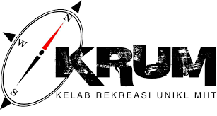
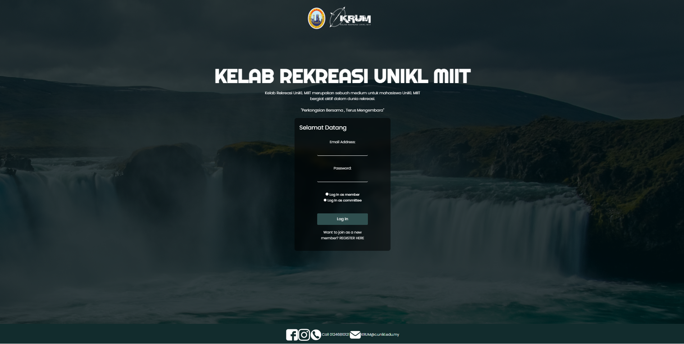
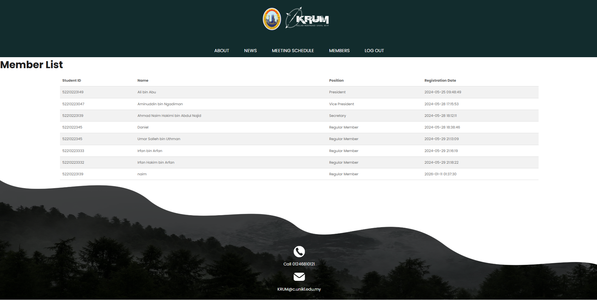
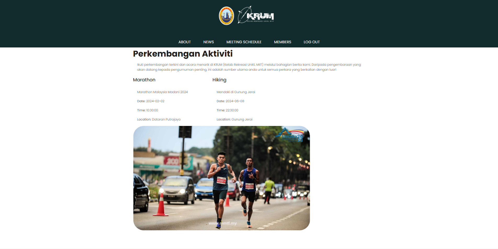
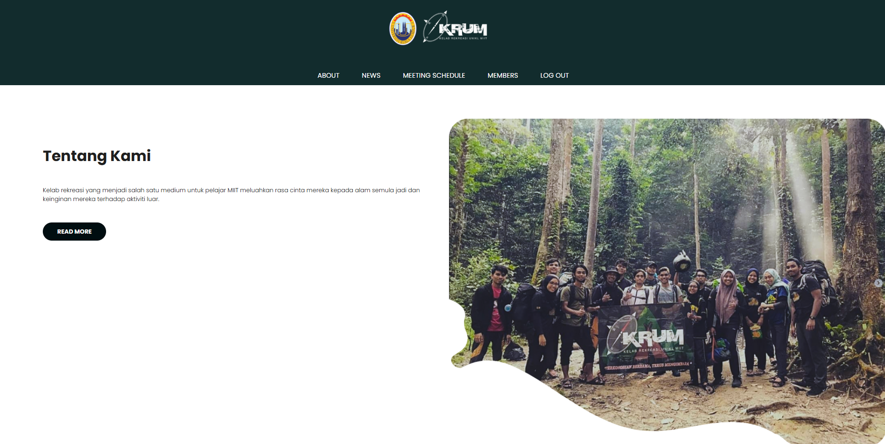
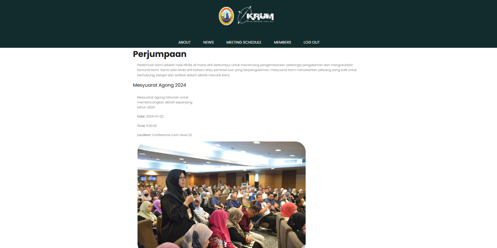
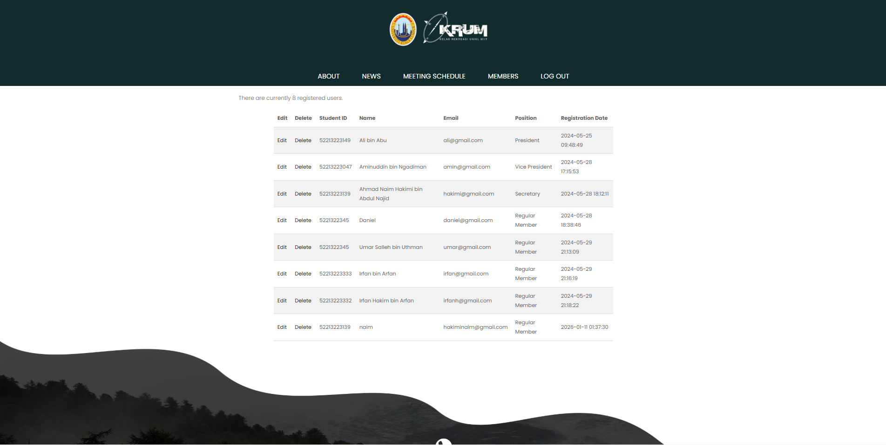
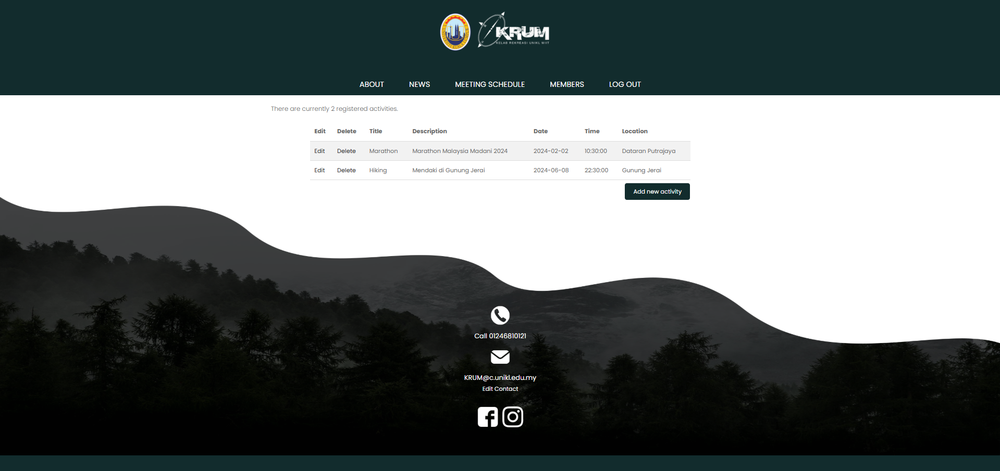

# KRUM - Recreation Club Management System

<div align="center">



**A comprehensive web-based management system for the KRUM Recreation Club (Kelab Rekreasi Alam Semula Jadi)**

[](https://www.php.net/)
[](https://www.mysql.com/)
[](https://getbootstrap.com/)
[](https://jquery.com/)
[](https://httpd.apache.org/)

[Features](#features) • [Installation](#installation) • [Project Structure](#project-structure) • [Tech Stack](#tech-stack) • [Screenshots](#screenshots)

</div>

---

## 📋 Overview

KRUM (Kelab Rekreasi Alam Semula Jadi - Recreation Club) is a student-led recreation club dedicated to promoting love for nature and outdoor activities. This project is a comprehensive web-based management system that allows admin to manage club information, members, meetings, news, and activities.

Whether you're a club officer managing member information or a member checking latest club updates, KRUM provides an intuitive interface for all your recreation club needs.

---

## ✨ Features

### 👥 Member Management

- View all registered club members
- Member registration with validation
- Student ID tracking
- Position tracking within the club
- Member registration date history

### 📰 News Management

- Create and publish club news articles
- Update existing news posts
- Delete outdated content
- Read more functionality for detailed articles
- Admin panel for content management

### 📅 Meeting Management

- Schedule and announce club meetings
- View all upcoming meetings
- Meeting details including date, time, and location
- Admin controls for adding and editing meetings

### ℹ️ Club Information

- Dynamic about page managed by admin
- Club description and mission
- Editable contact information
- Professional presentation of club details

### 🔐 Authentication System

- Secure member login
- Separate admin authentication
- Password encryption using SHA1
- Two login types: Members and Committees

### 🎨 Admin Dashboard

- Centralized admin panel
- Easy content management
- User-friendly interface for all administrative tasks
- Full CRUD operations for all content

---

## 🛠️ Tech Stack

### Key Technologies

- **Backend:** PHP with MySQLi database connectivity
- **Frontend:** HTML5, CSS3, JavaScript
- **Framework/Library:** Bootstrap 5 for responsive design, jQuery for DOM manipulation
- **Server:** XAMPP (Apache + MySQL)
- **Additional:** Font Awesome icons, Fancy Box galleries, AJAX, jQuery Validation

---

## 📁 Project Structure

```
Krum2/
├── index.php                  # Homepage and login page
├── about.php                  # About page
├── members.php               # Members listing
├── news.php                  # News feed
├── meeting.php               # Meetings schedule
├── read-more.php             # Detailed news article
├── register.php              # Member registration
├── login_handle.php          # Login processing
├── mysqli_connect_krum.php   # Database connection
│
├── admin/                    # Admin panel
│   ├── admin.php            # Main admin dashboard
│   ├── admin-members.php    # Manage members
│   ├── admin-news.php       # Manage news
│   ├── admin-meeting.php    # Manage meetings
│   ├── admin-about.php      # Manage about page
│   ├── add-news.php         # Add new article
│   ├── add-meeting.php      # Add new meeting
│   ├── edit-*.php           # Edit content
│   ├── delete-*.php         # Delete content
│   └── delete_user.php      # Delete members
│
├── includes/                 # Shared templates
│   ├── header.html          # Page header
│   ├── footer.html          # Page footer
│   ├── admin-header.html    # Admin header
│   └── admin-footer.html    # Admin footer
│
├── css/                      # Stylesheets
│   ├── bootstrap.min.css
│   ├── style.css
│   ├── responsive.css
│   └── ...other CSS files
│
├── js/                       # JavaScript files
│   ├── jquery.min.js
│   ├── bootstrap.bundle.min.js
│   ├── custom.js
│   └── ...other JS files
│
├── images/                   # Project images and icons
├── fonts/                    # Custom fonts
├── README-ASSETS/            # Documentation images
└── krum_database (2).sql    # Database dump

```

---

## 📊 Database Schema

### Key Tables

**members**

- student_id (PK)
- name
- email (unique)
- password (SHA1 encrypted)
- position
- registration_date

**committees**

- committee_id (PK)
- email (unique)
- password (SHA1 encrypted)
- name
- position

**news**

- news_id (PK)
- title
- content
- author
- date_posted
- date_updated

**meetings**

- meeting_id (PK)
- title
- date
- time
- location
- description

**about**

- about_id (PK)
- title
- description

---

## 📸 Screenshots

### User Interface

<div align="center">

#### Login Page



#### Members Page



#### News Page



#### About Page



#### Meetings Page



</div>

### Admin Panel

<div align="center">

#### About Page Management


#### Members Management



#### News Management



</div>

---

## 🔒 Security Features

- **Password Encryption:** SHA1 hashing for password storage
- **SQL Injection Prevention:** MySQLi prepared statements
- **Session Management:** PHP session handling for authentication
- **Form Validation:** Server-side validation for all inputs

---

## 🎯 Usage

### For Members

1. **Register** → Create a new member account
2. **Login** → Access member portal
3. **View Members** → See all club members
4. **Read News** → Check latest club updates
5. **View Meetings** → Check scheduled meetings
6. **About** → Learn about the club

### For Admins

1. **Login** → Access admin dashboard
2. **Manage Members** → Add, edit, delete members
3. **Manage News** → Create, edit, delete news articles
4. **Manage Meetings** → Schedule and manage meetings
5. **Manage About** → Update club information
6. **Manage Contact** → Update contact details


<div align="center">

**Made with ❤️ for KRUM Recreation Club**

⭐ If you found this project helpful, please consider giving it a star!

</div>
